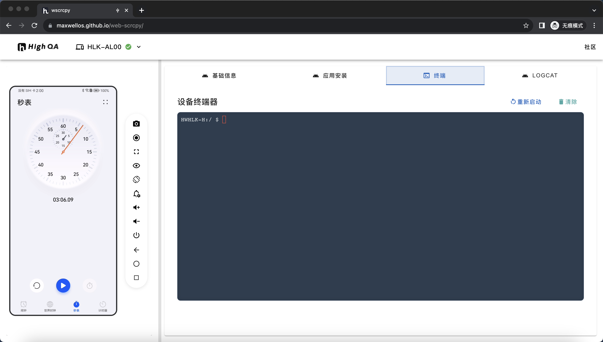

# panda-web-scrcpy

## 项目背景
这个项目最初是拿来做实验,后面会进行优化scrcpy的传输协议，录制等功能。

## 项目简介
panda-web-scrcpy 是一个基于Web的远程控制工具，允许用户通过浏览器控制和查看Android设备的屏幕。
- **高性能**：使用高效的视频编码和解码技术，提供流畅的屏幕镜像体验。
- **低延迟**：优化的数据传输协议，确保低延迟的控制响应。
- **多功能**：支持屏幕录制、截图、全屏模式等多种功能。
- **跨平台**：支持Windows、macOS和Linux操作系统。

## 使用说明
panda-web-scrcpy 继承了scrcpy的优点，提供了高性能、低延迟的屏幕镜像和控制功能。以下是详细的使用说明：
1. 连接Android设备到电脑，并确保设备已启用开发者选项和USB调试。
2. 打开浏览器，访问 [在线体验地址](https://pandatestgrid.github.io/panda-web-scrcpy/)。
3. 按照页面提示，连接并控制Android设备。
4. 使用鼠标和键盘与设备进行交互，支持全屏模式、屏幕录制和截图功能。

## 贡献指南
欢迎任何形式的贡献！请遵循以下步骤：
1. Fork 本仓库
2. 创建一个新的分支 (`git checkout -b feature-branch`)
3. 提交你的更改 (`git commit -am 'Add some feature'`)
4. 推送到分支 (`git push origin feature-branch`)
5. 创建一个新的Pull Request

## 许可证信息
本项目使用 [MIT 许可证](LICENSE)。

## 🙏致谢
 Tango ADB 
